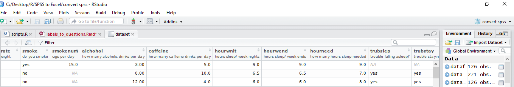

```{r setup, include=FALSE}
knitr::opts_chunk$set(echo = TRUE)
```

### Useful for sharing SPSS (.sav) file on Excel or CSV format.

This is a very quick way to read a .sav file and swap the question codes with the question labels. That can be useful if you want to share an SPSS survey file with someone who doesn't have SPSS on his PC.

I will assume the one who reads this is familiar with R basic commands, variables declaration, function definition, etc. So it is not for people with zero knowledge of R basic syntax.

### Why this matters?

**Short story**

I recently received an SPSS file (.sav) from a friend for some analysis. Since I do not have an SPSS on my PC, I had to use my good friend, R, to read it. I then google the famous "how to read a .sav file in R". I came up with some blog posts that explained how to read the file but with no additional warning on possible issues with questions' labels.

Once I knew how to read the file, it looked like a straightforward task for me and I thought R was going to easily ingest the dataset and I'd be able to do the analysis. I was wrong and disappointed when I realized the first row of the returned DataFrame did not contain the questions labels but the questions' codes.

I confirmed there were questions labels by viewing the meta structure of the DataFrame. Now that, I had the confirmation, the next milestone was to have the questions' codes replaced by the questions' labels so that the dataset can be human-readable and nicely organized to be shared on CSV or XLSX format.

I sought on the internet, visited many blogs and watched Youtube videos, I could not find an adequate solution. So, I went to the foreign package documentation, the solution was there but not so obvious. I spent some time figuring out how to use the package to capture the questions' labels and at the end swap them with the questions' code. Finally, I was able to find a solution to the issue.

**The moral of the story**

You may be in the position of the one that will receive or the one that will share a data set from SPSS software but can't manage to export a proper CSV or Excel file for your client. 

You never know, some people may be searching desperately a solution for a similar problem just like I was. Hopefully, if they come across this article, it will save them some time.


### First install and upload the foreign package

The package used to read the SPSS file in R is the **foreign** package. This package has a useful **read.spss** function to ingest the .sav file provided by the SPSS software.

```{r warning=FALSE, message=FALSE}
#install.packages("foreign") 
## uncomment the line above to install the foreign package if it is not pre-installed in your PC.

library(foreign) #load the package
```

### Read the sav file using the read.spss function from the foreign package.

For this demonstration, I am using a dataset from the [web page](http://spss.allenandunwin.com.s3-website-ap-southeast-2.amazonaws.com/data-files.html#.XmlmC6hKjIU). Credit goes to the page author for making the dataset availlable for us.

If you want to try the solution with the same dataset, click on: [download](http://spss.allenandunwin.com.s3-website-ap-southeast-2.amazonaws.com/Files/sleep.zip).

Let's now read the file:

```{r message=FALSE, warning=FALSE}
dataset <- read.spss("./data/sleep.sav", to.data.frame = TRUE)

#Use file.choose() to graphically attached the file to the read.spss function if your not comfortable writing path to file manually. 
#dataset <- read.spss(file.choose(), to.data.frame = TRUE)

head(dataset[1:7])
```

The first 5 lines of the first 7 columns of the dataset show the columns' names. But they are not useful as they do not allow us to understand what the columns' values are about.

Be aware that SPSS gathers the survey responses in a specific tab, and in additional tabs you can read the question labels and the question values for single or multiple choice questions when using the software. Now, in R, we only obtain the questions code. That is not so useful if we want to save this dataset as CSV to share with friends. We will correct that.

**Let's confirm that the file contains questions' labels**
```{r warning=FALSE, message=FALSE}
View(dataset)

```

By executing this command, R studio will open a new tab with a table showing the questions' codes associated with the questions' labels. See the following picture:




### How to access the questions' labels of a .sav file in R?.

As I mentioned in the story, I found a way to access the questions' labels thanks to the **foreign** package **read.spss** documention [here](https://www.rdocumentation.org/packages/foreign/versions/0.8-75/topics/read.spss).

In the detail section of te documention, one can read this: "If SPSS variable labels are present, they are returned as the "variable.labels" attribute of the answer". Very clear, right?

If that is esoteric for you, play with the **to.data.frame** parameter by setting it to *FALSE*. You will notice that **variable.labels** is truly an element of the list returning by the function call. As an attribute of the results object, we can directly extract it by calling the attributes() function on the results' object.

```{r warning=FALSE, message=FALSE}
library(dplyr) #load it to use glimpse()

results <- read.spss("./data/sleep.sav", to.data.frame = FALSE)

#class(results) # Show the class of results, a list indeed.
#glimpse(attr(data, "variable.labels")) #show brief description of each attributes of the elements of the list.

#length(attributes(results)$variable.labels) # confirm the number of labels.
attributes(results)$variable.labels[c(1:5)] # show the first 5 elements of the named vector.

```

Now that we have the list of the labels, we can proceed. But, we won't be able to just read it now, we need to first extract the labels because they are still attached to the questions' codes. In fact, the returning data structure of the previous lines of code is a named vector where each vector member is assigned a name which is a question code. Let's convert and store the named vector in a DataFrame variable.

```{r warning=FALSE, message=FALSE}

results.labels = as.data.frame(attributes(results)$variable.labels)

#Print the five first rows
head(results.labels)

```

Nice! let's rename the column "attributes(results)$variable.labels"

```{r warning=FALSE, message=FALSE}
names(results.labels) <- "labels"


head(results.labels)

```
Perfect. We can now simply extract the columns labels in a character vector.

```{r warning=FALSE, message=FALSE}
labels <- as.character(results.labels$labels) 
labels[1:10]

```

### Let's start swapping finally!!!

Since we manage to extract the labels of the questions. We can swap them with the questions' codes now and rename the columns' names, and lastly save it for sharing with humans who do not have SPSS!

**Why do we need to swap instead of just replace the questions' codes by the labels?**

If you are still following and is an intermediate R user, you may be asking the above question. Here is the answer. We need to swap because not all the questions' codes have a matching label! So, we need to make sure we don't replace questions' codes with empty strings. If a question's code is not associated with a label, we won't swap it and keep it in place. So, now we are agreed, right? let's continue!

Remember, earlier we read the data from the .sav file and saved it in **dataset** variable as a DataFrame by setting **to.data.frame** of the **read.spss** function to **TRUE**.

Now we will write a function that will take the question codes and the labels as parameters and swap them whenever possible.

```{r warning=FALSE, message=FALSE}
swap_qc_l <- function(q_codes, q_labels){
  questions <- character()
  
  #Test if the vectors are on the same length. if they are not, big trouble!
  assertthat::are_equal(length(q_codes), length(q_labels))  
  for(i in 1:length(q_codes)){
    if(q_labels[i] == ""){
      questions[i] = q_codes[i]
    }else{
      questions[i] = q_labels[i]
    }
  }
  return(questions)
}
```

**We can call the function now**.

```{r warning=FALSE, message=FALSE}

question_codes <- as.character(colnames(dataset)) #First extract questions' codes. first row of the DataFrame dataset.

questions <- swap_qc_l(question_codes,labels)

colnames(dataset) <- questions
head(dataset[1:7])

```

Voila! If you want to be sure that there was no error in swapping vectors, you can call **View()** again with **dataset** as an argument to see if the labels swapped match the preset ones.

```{r warning=FALSE, message=FALSE}
#View(dataset)

#write.csv(dataset, file="./data/sleep_corr.csv", row.names = FALSE) # to save the cool dataset with questions properly in place to CSV

```


Thank you for reading, don't forget to share in your network to help others.

Peace!


